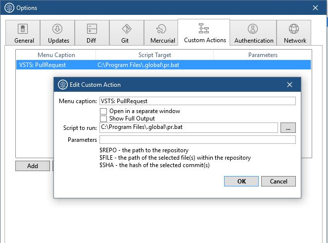
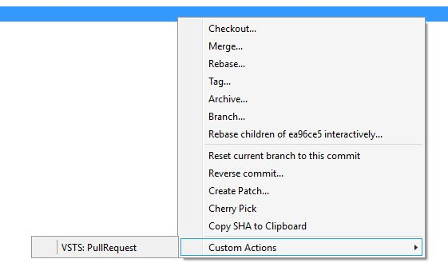
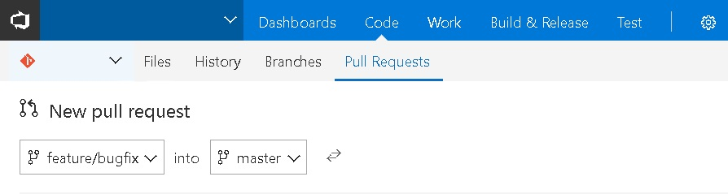

# Create a pullrequest on Visual Studio Team Services (VSTS) from SourceTree #

- Copy [pr.bat](pr.bat) and [pr.ps1](pr.ps1) to a folder on your machine

- Create a custom action in SourceTree

- On a random commit right click

- Chrome browser will open with a new PR with current branch -> master

## Pro tip
If you add the pr.bat to a global path, you can also run it from the commandline
